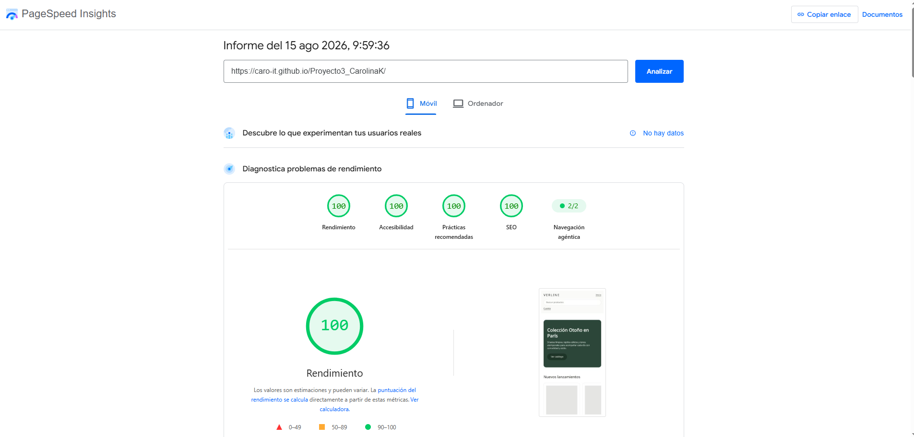

Verline — Prototipo de tienda online

Prototipo visual y responsive de e-commerce para una marca ficticia de ropa
con sede en Francia. Proyecto realizado en el bootcamp de Ingeniería de IA
de 4Geeks Academy.

**Ver el prototipo:** [PEGAR AQUÍ LA URL DE GITHUB PAGES]

---

## Vistas

| Vista | Archivo | Contenido |
|---|---|---|
| Home | [index.html](./index.html) | Hero de campaña, nuevos lanzamientos y más vendidos |
| Catálogo | [catalogo.html](./catalogo.html) | Filtros por categoría y talla, rejilla de 20 productos |
| Producto | [producto.html](./producto.html) | Ficha a dos columnas y descripción detallada |
| Carrito | [carrito.html](./carrito.html) | Listado de productos y resumen de totales |
| Checkout | [pago.html](./pago.html) | Formulario de pago en tres pasos |

Navbar y footer se reutilizan en las cinco vistas.

---

## Stack

- **HTML5** semántico
- **Tailwind CSS v4**, compilado con `@tailwindcss/cli`
- **Schema.org** (JSON-LD): `Organization` en la home, `Product` en la ficha
- **GitHub Pages** para el despliegue

Se descartó el Play CDN de Tailwind: su propia documentación lo limita a
entornos de desarrollo, y este prototipo se publica y se mide en producción.
El CSS se compila a un archivo estático y se enlaza con `<link>`.

---

## Ejecutar en local

```bash
npm install
npx @tailwindcss/cli -i ./src/input.css -o ./dist/output.css --watch
```

Con el watch corriendo, abre `index.html` con Live Server (o cualquier
servidor estático). El CSS se recompila al guardar.

`dist/output.css` está versionado a propósito: GitHub Pages sirve archivos
estáticos y no ejecuta ningún paso de build.

---

## Rendimiento



[UNA FRASE CON LA PUNTUACIÓN OBTENIDA, CUANDO LA MIDAS]

---

## Flujo de trabajo

Proyecto individual. Se aplicó el flujo de ramas y pull requests que pide
el enunciado; la revisión cruzada entre dos personas no aplica.

- Una rama por vista: `feature/inicio`, `feature/catalogo`,
  `feature/producto`, `feature/carrito`, `feature/pago`
- Una pull request por rama, con descripción de los cambios
- Commits por cambio lógico, con mensajes descriptivos en español
- `main` reservada para el esqueleto compartido y los merges

---

## Estructura

```
.
├── index.html
├── catalogo.html
├── producto.html
├── carrito.html
├── pago.html
├── src/input.css
├── dist/output.css
├── docs/briefing.md
├── pagespeed-result.png
├── CLAUDE.md
└── README.md
```

---

Autora: Carolina ([@Caro-it](https://github.com/Caro-it))
Bootcamp de Ingeniería de IA — 4Geeks Academy
